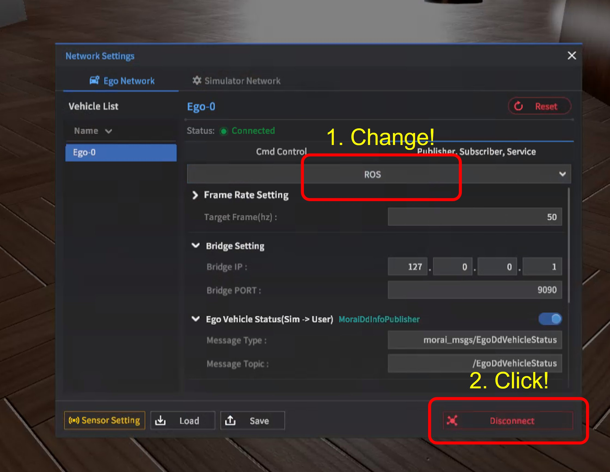
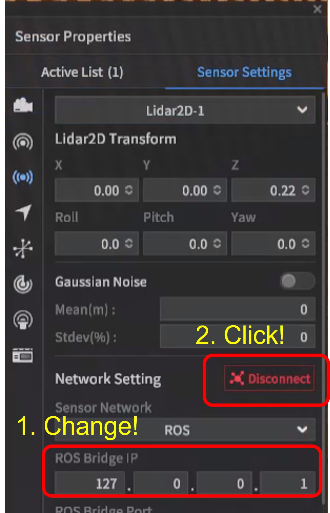

# 2D LiDAR MAPPING EXAMPLE

## Docker install
```bash
curl -fsSL https://get.docker.com -o get-docker.sh
sudo sh get-docker.sh
```

## Build
```bash
git clone https://github.com/morai-developergroup/SLAM-example.git
cd SLAM-example/lidar2d_mapping
./build.sh
```

## Run

### On host:
```bash
roscore
```
#### City map
```bash
cd SLAM-example/lidar2d_mapping
rviz -d city.rviz
```
#### Office map
```bash
cd SLAM-example/lidar2d_mapping
rviz -d office.rviz
```

### On docker image:
```bash
cd SLAM-example/lidar2d_mapping
./run.sh
```
#### City map
```bash
roslaunch lidar2d_mapping map:=city
```
#### Office map
```bash
roslaunch lidar2d_mapping map:=office
```
#### Network Connect
Edit -> Network Settings -> Publisher, Subscriber, Service -> ROS setting
<p align="center"></p>

#### Sensor Connect
Sensor -> Sensor Edit Mode -> 2D LiDAR Sensor Spawn -> Network Setting
<p align="center"></p>
